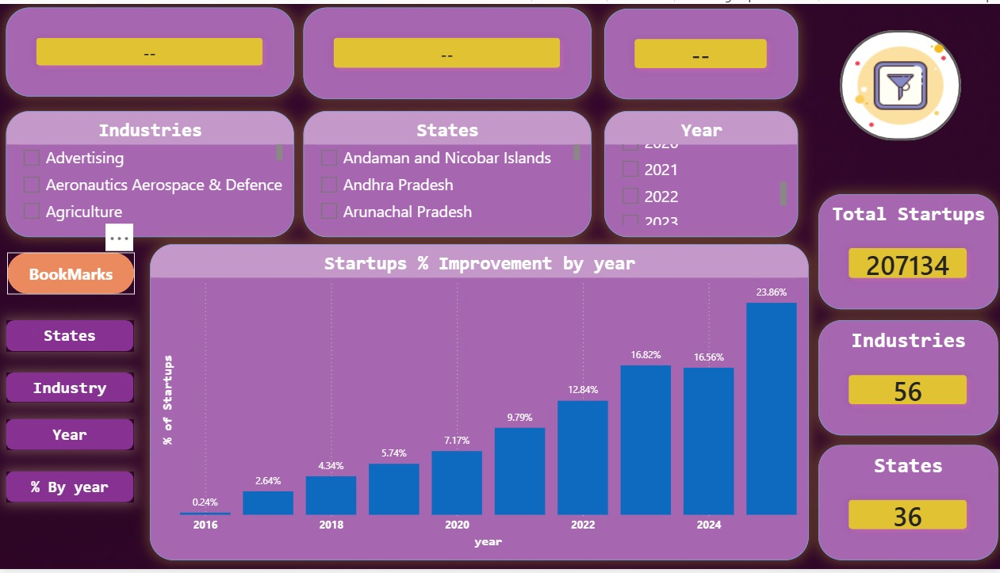
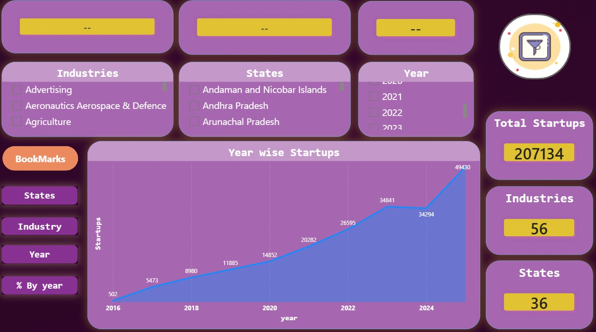
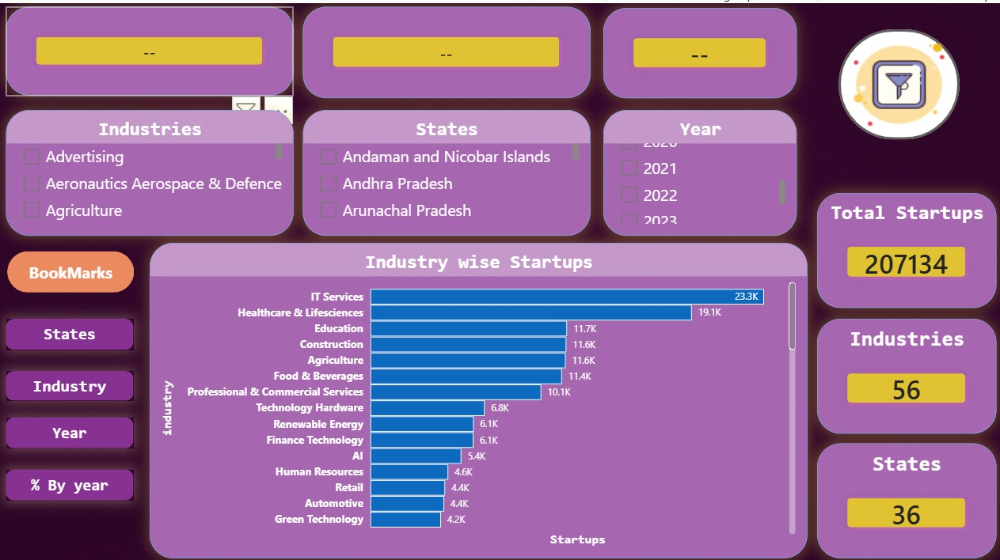
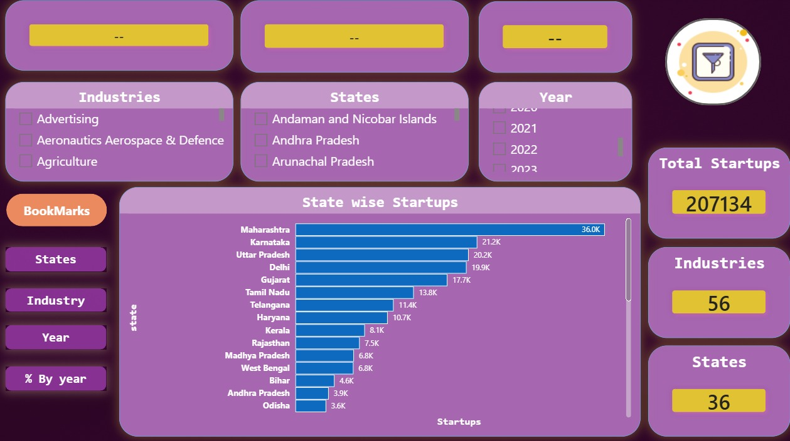

# 🚀 India Startup Ecosystem — DPIIT Recognized Startups Dashboard (2016–2025)

An interactive Power BI dashboard analyzing **207,134 DPIIT-recognized startups** across India, built on open government data. The dashboard explores startup growth trends, state-wise distribution, industry composition, and year-on-year percentage contribution — from the launch of Startup India in 2016 through 2025.

---

## Dataset

| Attribute | Details |
|---|---|
| Source | [Dataful.in](https://dataful.in/datasets/15737/) (originally DPIIT / data.gov.in) |
| Updated | As of April 2026 |
| Rows | 9,932 |
| Columns | 4 (year, state, industry, startups_recognized) |
| Coverage | 2016–2025 · 36 States/UTs · 56 Industries |

> Per DPIIT definition: a startup must be < 10 years old from incorporation and must not have exceeded ₹100 crore turnover in any financial year.

---

## Dashboard Structure

A **single-page dashboard** with bookmark-based navigation. Clicking a bookmark in the left panel swaps the main chart while the slicers and KPI cards remain fixed on screen.

**Left Panel — Bookmark Navigation**
- % By Year
- Year
- Industry
- States

**Top Row — Slicers (cross-filter enabled)**
- Industry · State · Year

**Right Panel — KPI Cards (always visible)**
- Total Startups: 207,134
- Industries: 56
- States: 36

---

## Views

### % By Year — Startups % Improvement by Year

Column bar chart showing each year's contribution as a percentage of the total 207,134 startups.

**2025 alone accounts for 23.86% of all startups ever recognized.**

| Year | % Share |
|------|---------|
| 2016 | 0.24% |
| 2017 | 2.64% |
| 2018 | 4.34% |
| 2019 | 5.74% |
| 2020 | 7.17% |
| 2021 | 9.79% |
| 2022 | 12.84% |
| 2023 | 16.82% |
| 2024 | 16.56% |
| 2025 | 23.86% |

---

### Year — Year wise Startups

Area chart showing the absolute count of startups recognized each year.

Growth from **502 (2016) → 49,430 (2025)** — a 98× increase over 10 years.

| Year | Startups |
|------|----------|
| 2016 | 502 |
| 2017 | 5,473 |
| 2018 | 8,980 |
| 2019 | 11,885 |
| 2020 | 14,852 |
| 2021 | 20,282 |
| 2022 | 26,595 |
| 2023 | 34,841 |
| 2024 | 34,294 |
| 2025 | 49,430 |

---

### Industry — Industry wise Startups

Horizontal bar chart (descending). IT Services leads by a significant margin; Healthcare is a strong second. Agriculture, Education, and Construction in the top 5 confirm that the ecosystem is broader than just metro tech.

| Rank | Industry | Startups |
|------|----------|----------|
| 1 | IT Services | 23,300 |
| 2 | Healthcare & Life Sciences | 19,100 |
| 3 | Education | 11,700 |
| 4 | Construction | 11,600 |
| 5 | Agriculture | 11,600 |
| 6 | Food & Beverages | 11,400 |
| 7 | Professional & Commercial Services | 10,100 |
| 8 | Technology Hardware | 6,800 |
| 9 | Renewable Energy | 6,100 |
| 10 | Finance Technology | 6,100 |
| 11 | AI | 5,400 |

---

### States — State wise Startups

Horizontal bar chart (descending). Top 5 states account for ~57% of all recognized startups.

**Maharashtra leads — not Karnataka.** That was the instinct I wanted to test when I started this project.

| Rank | State | Startups |
|------|-------|----------|
| 1 | Maharashtra | 36,000 |
| 2 | Karnataka | 21,200 |
| 3 | Uttar Pradesh | 20,200 |
| 4 | Delhi | 19,900 |
| 5 | Gujarat | 17,700 |
| 6 | Tamil Nadu | 13,800 |
| 7 | Telangana | 11,400 |
| 8 | Haryana | 10,700 |
| 9 | Kerala | 8,100 |
| 10 | Rajasthan | 7,500 |

---

## Tools Used

| Tool | Purpose |
|---|---|
| Microsoft Power BI Desktop | Data visualization and dashboard development |
| Power Query (M) | Data loading, column renaming, and type verification |
| Dataful.in | Dataset discovery (originally DPIIT / data.gov.in) |

---

## Key Insights

1. India's recognized startup count grew **98×** between 2016 and 2025
2. **2025 was the biggest single year** — 23.86% of all startups ever recognized
3. **Maharashtra leads, not Karnataka** — though Bangalore's ecosystem is undeniable
4. **Agriculture ranks #5** by industry — Bharat is building, not just metros
5. **2020 (COVID year) still saw 25% YoY growth** — policy momentum didn't pause

---

## Limitations

- Covers only DPIIT-recognized startups — informal ventures are excluded
- No data on funding, valuations, or shutdown rates
- The 2025 figure is an April 2026 snapshot — not a complete calendar year
- State data does not break down to city level (no Bangalore vs. Pune granularity)

---

## Author

**Soban M** | 
-- Am not holding any ownership on the dataset.Dataful had every right of ownership on the dataset and i used for just educational purpose.