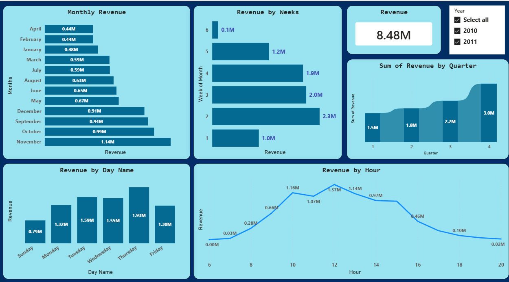
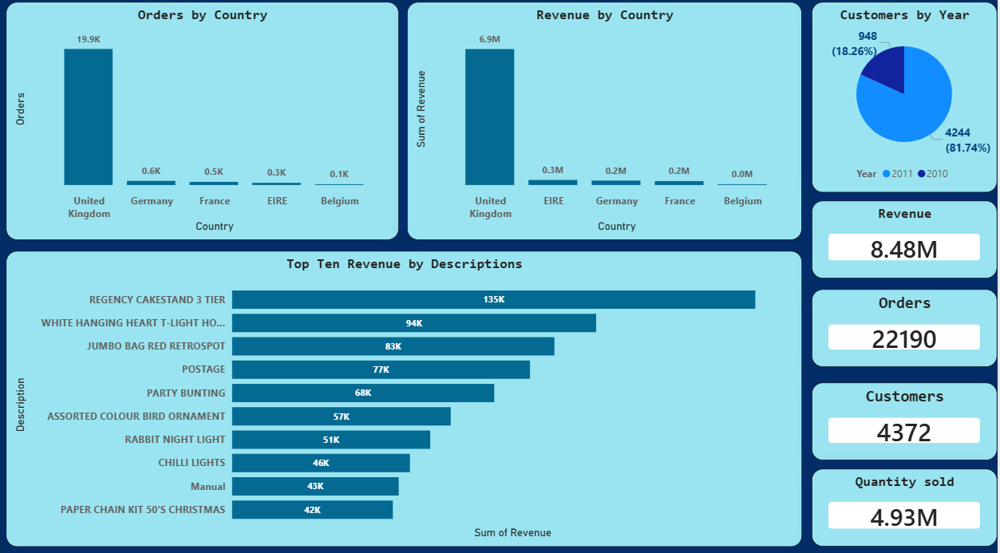

# Tata Group Data Visualisation – Forage Virtual Experience

## Project Overview

This project was completed as part of the **Tata Group Data Visualisation: Empowering Business with Effective Insights** virtual experience programme on Forage. The objective was to analyse an online retail dataset and build an interactive Power BI dashboard that provides actionable insights for business leadership — specifically a CEO and CMO.

Rather than just answering the given problem statement, I proactively built a full Power BI dashboard before framing the business questions. This approach gave me a deeper understanding of the data, which helped me anticipate the kind of questions senior leadership would realistically ask.

---

## Tools Used

- **Power BI Desktop** – Data cleaning, transformation, and dashboard building
- **Microsoft Excel** – Source dataset (Online Retail.xlsx)

---

## Dataset

**Source:** UCI Machine Learning Repository  
**Reference:** Daqing Chen, Sai Liang Sain, and Kun Guo – *Data mining for the online retail industry: A case study of RFM model-based customer segmentation*, Journal of Database Marketing and Customer Strategy Management, Vol. 19, No. 3, pp. 197–208, 2012.

**Columns in the dataset:**

| Column | Description |
|---|---|
| InvoiceNo | Unique invoice number for each transaction |
| StockCode | Unique product/item code |
| Description | Name/description of the product |
| Quantity | Number of units purchased per transaction |
| InvoiceDate | Date and time of the transaction |
| UnitPrice | Price per unit of the product |
| CustomerID | Unique identifier for each customer |
| Country | Country where the customer is located |

---

## Data Cleaning & Transformation Steps (Power BI)

All transformations were performed in **Power Query Editor** inside Power BI Desktop.

### 1. InvoiceNo – Extract numeric values only
- Some invoice numbers contained non-numeric characters and empty spaces
- Extracted the last 6 characters and filtered to retain only numeric invoice numbers
- This ensured clean, consistent invoice identification

### 2. StockCode – Changed data type to Text
- StockCode contained a mix of numeric and alphanumeric values (e.g., `14302` and `14302E` are two distinct products)
- Changing the type to Text preserved these distinctions and prevented Power BI from treating them as numbers

### 3. Quantity – Replaced negative values with zero
- Some rows had negative quantities (likely representing returns or data entry errors)
- Replaced all negative values with `0` to avoid distorting revenue and quantity calculations

### 4. Description – Removed empty rows
- Rows with null or blank descriptions were removed to maintain data quality

### 5. CustomerID – Removed empty rows
- Transactions without a CustomerID were removed since customer-level analysis required a valid ID

### 6. InvoiceDate – Removed empty rows
- Rows with missing invoice dates were removed to enable accurate time-based analysis

### 7. StockCode – Removed empty rows
- Rows with blank StockCodes were removed to avoid unidentified product records

### 8. Date Column – Extracted time intelligence columns
From the `InvoiceDate` column, the following new columns were extracted:

| New Column | Purpose |
|---|---|
| Year | Filter and compare across years |
| Month Name | Display month labels on charts |
| Month Number | Sort months chronologically (1–12) |
| Quarter | Group into Q1–Q4 |
| Day Name | Analyse revenue by day of the week |
| Week of Month | Understand intra-month purchase patterns |
| Week Number | Weekly trend analysis |

> **Note:** Month Number and Week Number were extracted specifically to enable correct chronological sorting in visuals, since Power BI sorts alphabetically by default.

---

## Dashboard Structure

### Page 1 – Revenue & Time Analysis
- Monthly Revenue – Horizontal bar chart showing revenue by month
- Revenue by Week of Month – Bar chart for intra-month patterns
- Revenue by Quarter – Area chart showing quarterly progression
- Revenue by Day Name – Bar chart showing which days generate most revenue
- Revenue by Hour – Line chart showing peak purchasing hours
- Total Revenue KPI Card
- Year Slicer – Filter by 2010 and 2011

### Page 2 – Country, Product & Customer Analysis
- Orders by Country – Bar chart showing order volume per country
- Revenue by Country – Bar chart showing revenue contribution per country
- Top 10 Revenue by Product Description – Horizontal bar chart
- Customers by Year – Pie chart showing 2010 vs 2011 customer split
- KPI Cards – Revenue, Orders, Customers, Quantity Sold

---

## Key Insights

### Overall KPIs
- Total Revenue: £8.48M
- Total Orders: 22,190
- Total Customers: 4,372
- Total Quantity Sold: 4.93M

### Monthly Revenue
- Highest month: November at £1.14M
- Lowest months: April and February both at £0.44M
- Strong performance also seen in October (£0.99M) and September (£0.94M)
- Clear Q4 demand surge driven by holiday shopping season

### Revenue by Quarter
- Q1: £1.5M
- Q2: £1.8M
- Q3: £2.2M
- Q4: £3.0M — highest quarter, accounting for approximately 35% of total annual revenue

### Revenue by Week of Month
- Week 2 drives the highest revenue at £2.3M
- Week 1 is the slowest at £1.0M
- Revenue is strong through weeks 2, 3, and 4 before dropping in week 6

### Revenue by Day of Week
- Thursday is the strongest day at £1.93M
- Tuesday and Wednesday follow at £1.59M and £1.55M respectively
- Sunday is the weakest day at £0.79M
- Weekdays significantly outperform the weekend

### Revenue by Hour
- Revenue builds from 9 AM and peaks at 12 PM with £1.37M
- The 10 AM to 2 PM window generates the majority of daily revenue
- After 4 PM purchases drop sharply
- Near-zero transactions after 6 PM indicating business-hours purchase behaviour

### Revenue & Orders by Country
- United Kingdom dominates with £6.9M revenue and ~19,900 orders
- Germany, France, EIRE, and Belgium are present but contribute minimally
- UK accounts for approximately 81% of total revenue

### Top 10 Products by Revenue
- Regency Cakestand 3 Tier: £135K
- White Hanging Heart T-Light Holder: £94K
- Jumbo Bag Red Retrospot: £83K
- Postage: £77K
- Party Bunting: £68K
- Assorted Colour Bird Ornament: £57K
- Rabbit Night Light: £51K
- Chilli Lights: £46K
- Manual: £43K
- Paper Chain Kit 50's Christmas: £42K

### Customers by Year
- 2010: 948 customers (18.26%)
- 2011: 4,244 customers (81.74%)
- Customer base grew nearly 4.5x in a single year

---

## How to Run

1. Download the `Online_Retail.xlsx` dataset from the UCI repository or Forage resources
2. Open `tatadataanalysis.pbix` in **Power BI Desktop**
3. If prompted, update the data source path to your local copy of the Excel file
4. Refresh the data and explore the dashboard

---

## Dashboard Preview

---

## Author

Built independently as part of the Tata Group Forage Virtual Experience Programme.  
Dashboard designed and developed in Power BI with custom data transformations applied in Power Query.