# 📡 TRAI Telecom Analytics 2025-26

An end-to-end analytics project tracking India's telecom market — subscriber growth, 5G FWA adoption, urban-rural divide, churn, and operator competition — built from raw TRAI regulatory PDFs through to a live Power BI dashboard.

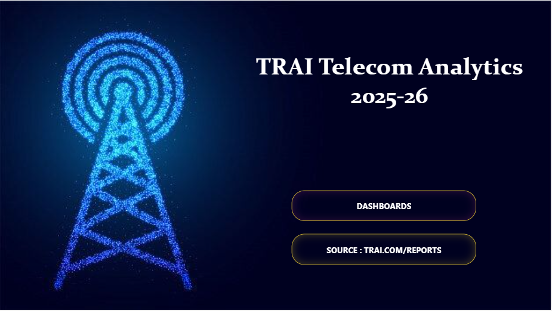

## 📌 Overview

This project covers **12 months of TRAI regulatory data (Apr 2025 – Mar 2026)** across **Jio, Airtel, Vodafone Idea (Vi), BSNL and MTNL**. It simulates a real-world analytics workflow: extracting data from official PDF press releases, modeling it in SQL, migrating it into a modern cloud warehouse, and shipping a single-page interactive dashboard.

## 🔧 Tech Stack

- **Extraction:** Claude (semantic parsing) + Gemini (gap-filling & validation)
- **SQL / Warehousing:** Google BigQuery, Microsoft Fabric (Lakehouse + Warehouse), T-SQL
- **Pipeline:** Dataflow Gen2
- **Visualization:** Power BI Service (DAX, bookmarks, custom tooltips)

## 🔄 Project Flow

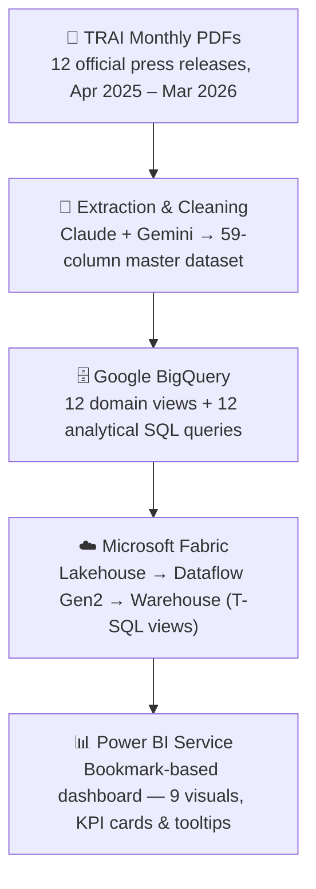

## 🗂️ How the Data Moves

1. **Collection** — 12 TRAI press release PDFs (17–25 pages each) downloaded directly from `trai.gov.in`.
2. **Structuring** — the 59 raw KPI columns were mapped into logical categories (Subscriber Base, Broadband, Geographic, Tele-Density, Churn, FWA/5G, Market Structure, etc.) before any SQL was written.

   

3. **BigQuery** — the master dataset was loaded into BigQuery, where 12 views and 12 analytical queries answer specific business questions (competitor battle, churn alerts, network health, volatility, etc.).
4. **Fabric Migration** — since direct loading into a Fabric Warehouse wasn't possible on this account, a **Lakehouse** was used to land the raw data, and a **Dataflow Gen2** moved it into a **Warehouse**, which supports full T-SQL (`CREATE VIEW`, unlike the read-only Lakehouse SQL endpoint). All 12 views were rebuilt here in T-SQL.

   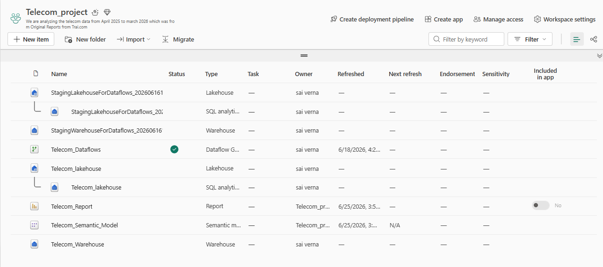

5. **Power BI Dashboard** — built entirely in Power BI Service (no Desktop), connected to the Fabric Warehouse. A single canvas uses **bookmarks** to swap between 9 business-question visuals, while KPI cards and a Subscriber Growth chart stay fixed at the top. Every visual has a custom tooltip with Q&A-style insights pulled from the SQL analysis.

### Dashboard Views

**Urban vs Rural Tele-Density Gap**
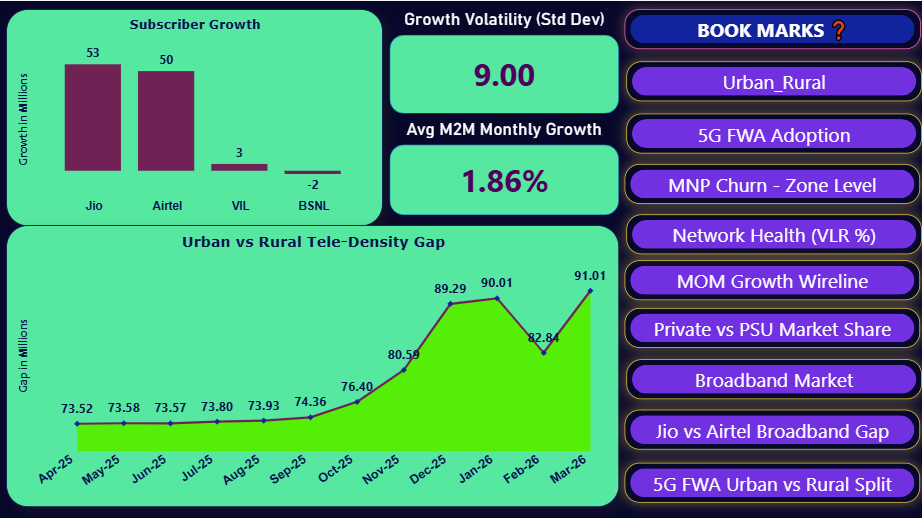

**5G FWA Adoption Velocity**
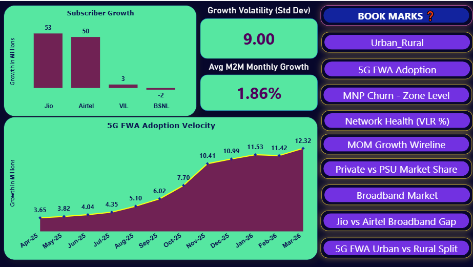

**MNP & Churn Trends — Zone Level**
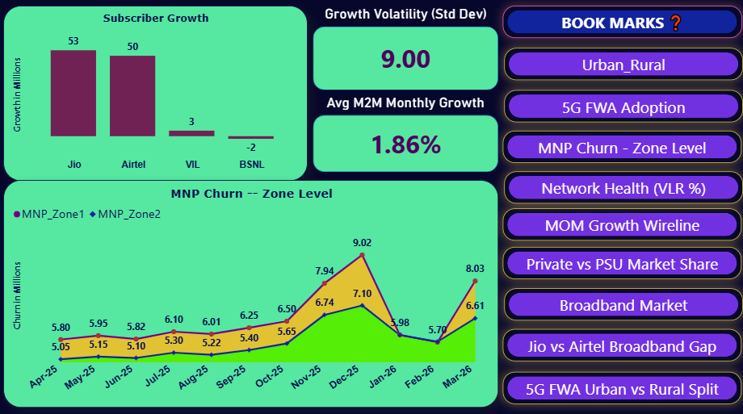

**Network Health — Active SIM Ratio (VLR %)**
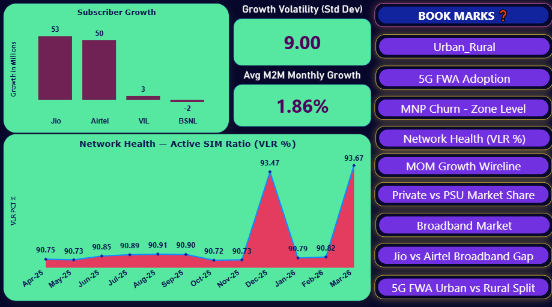

**MoM Growth — Wireline**
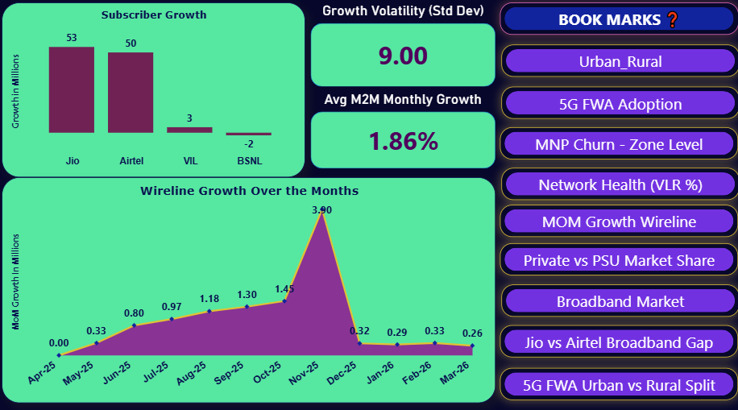

**Private vs PSU Market Share** *(default landing view)*
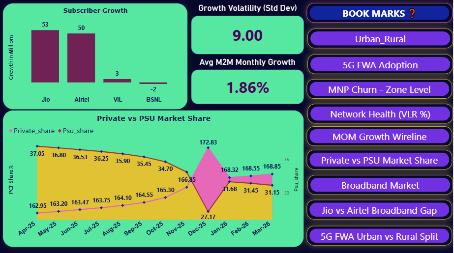

**Broadband Market Composition**
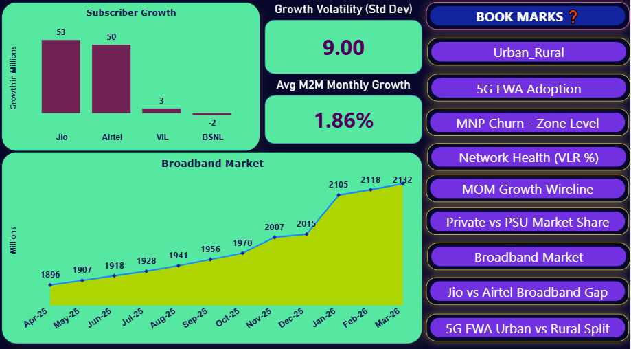

**Jio vs Airtel Broadband Gap**
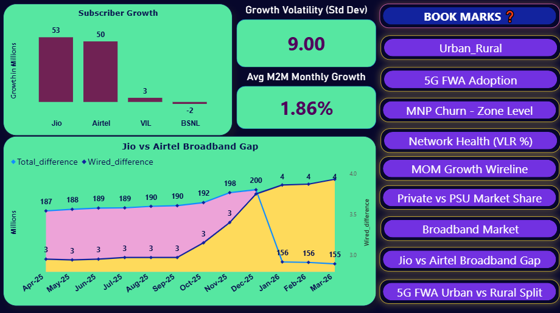

**5G FWA Urban vs Rural Split**
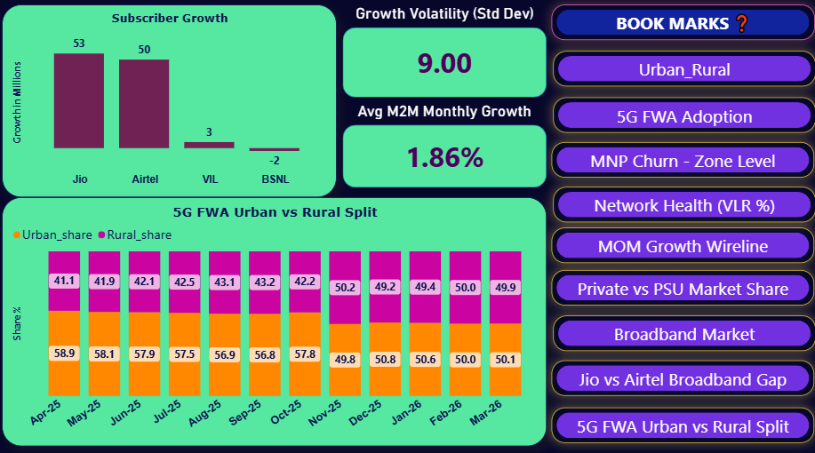

> 📄 Full visual walkthrough of all 9 dashboard views (with their tooltips and insights) is documented in `TRAI_Telecom_Analytics_Documentation.pdf` in this repo.

## 💡 Key Insights

- Jio and Airtel together captured almost all net new subscribers (26.57M + 24.87M), leaving Vi (~1.7M) and BSNL (net losses) further behind.
- Private operators aren't just dominant in wireless anymore — they're now eating into PSU wireline share too (28.90% → 23.65%).
- 5G FWA adoption cooled sharply after Nov-25, but it's no longer an urban-only story — rural share is nearly at parity with urban (49.92% vs 50.08%) by Mar-26.
- The urban–rural tele-density gap kept widening (73.52 → 91.01) even though rural tele-density itself improved in several months — urban growth simply outpaced it.
- Network health (VLR %) and wireline subscriber growth both trended positively across the year, pointing to healthier overall engagement alongside the broader digital divide.

## 👤 Author

**Soban**
📧 sobansaim.data07@gmail.com
🔗 [GitHub](https://github.com/sobansaidata07) · [Portfolio](https://sobansaidata07.github.io)

## 🗒️ Note

All data used in this project comes directly from TRAI's official monthly press releases, publicly available at trai.gov.in. This was a self-driven, independent project — planned, researched, and built solo, end to end, with no team behind it.